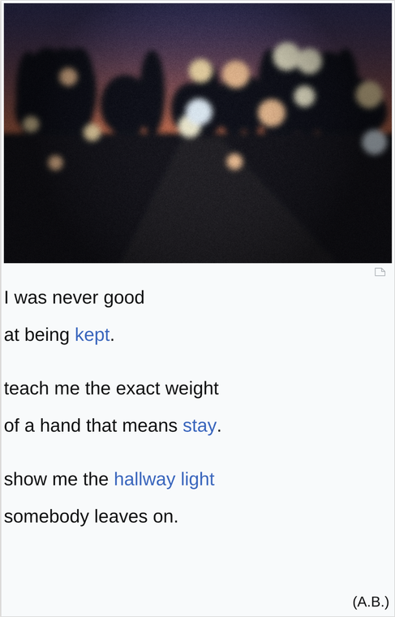

# yumbrr

A small studio for writing poems in the note-card format: a grainy photograph, a
few quiet lines, two or three words in link blue, initials in the corner.

**Open `index.html` in a browser.** No install, no build step, no server, no
account. Everything stays on your machine.



---

## Writing

| | |
|---|---|
| **Drop a photo** | Drag one in, click the box, or paste from the clipboard. Drag the photo *inside the card* to reframe it. |
| **Type the poem** | A blank line is a stanza break. |
| **Turn a word blue** | Tap it in the card, or select it and press `⌘K` / `Ctrl+K`. In the text it's written `[like this]`. |
| **Blue thread** | The panel under the editor reads your highlighted words back on their own. If they don't make a second small poem, highlight different ones — that's the whole trick. |
| **Notes** | Live nudges as you draft: naming the metaphor, ending on an abstraction, too much blue. |
| **Save PNG** | 1080 / 1440 / 2160 wide. Grain is re-rendered at full size so the export is sharper than the preview, never softer. |

Shortcuts: `⌘K` highlight · `⌘S` save to shelf · `⌘⇧E` export PNG.

## The photo

Five looks — **Flash**, **Faded**, **Dusk**, **Kitchen**, **Clean** — plus grain,
fade, warmth, light and vignette. The film treatment is baked into the bitmap
rather than layered over the card in CSS, so what you see is exactly what
exports.

Start from a bad photo. Underexposed, out of focus, nobody in frame. See
[CRAFT.md](CRAFT.md#4-the-photograph).

## The shelf

Saved poems live in your browser's local storage — **this browser, this machine,
nobody's server.** Clearing site data deletes them, so use **Export shelf
(.json)** now and then. **Import** merges a file back in and skips duplicates.

---

## Learning the form

[**CRAFT.md**](CRAFT.md) is a worked analysis of the four reference cards — the
engine, twelve moves, the photograph rule, and what kills it. The same guide is
in the app's **Craft** tab, along with a spark generator and first-line
scaffolds.

The short version:

> Admit a deficiency, then ask to be taught. Never name the metaphor — let
> *solder*, *wire* and *hinge* do it. Land every abstraction on an object.
> Highlight only the words the poem would collapse without.

---

## The format

Card geometry was measured off the reference images and is expressed in
`js/card.js` as fractions of card width, so every size renders identically:

```
card height   1.562 × width        type size     0.0469 × width
photo height  0.669 × photo width  leading       2.00 × type size
photo inset   0.008 × width        stanza gap    0.449 × leading
link blue     #3a66bd              card ground   #f8fafb
```

## Files

```
index.html      markup
css/app.css     everything visual outside the card
js/card.js      the format — layout, paint, and the [bracket] parser
js/film.js      grain, fade, warmth, vignette
js/craft.js     the guide, the sparks, the draft notes
js/store.js     local shelf + export/import
js/app.js       wiring
CRAFT.md        how to write the words
```

`js/card.js` is the single renderer — the live preview, the shelf thumbnails and
the exported PNG all run through the same function, which is why they can't
drift apart.

## Browser support

Any current Chrome, Safari, Firefox or Edge, desktop or phone. Plain scripts, no
modules, so opening the file directly from disk works — nothing needs to be
served.
